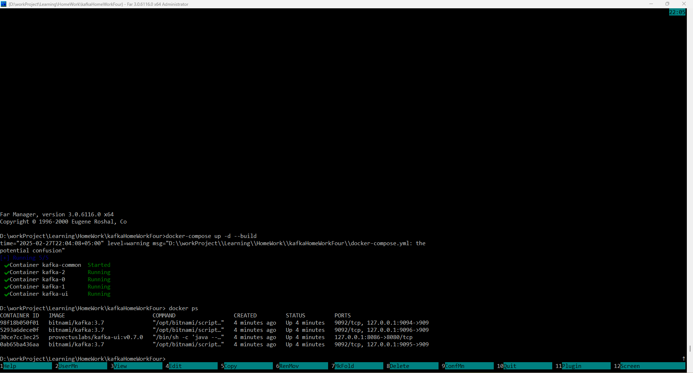
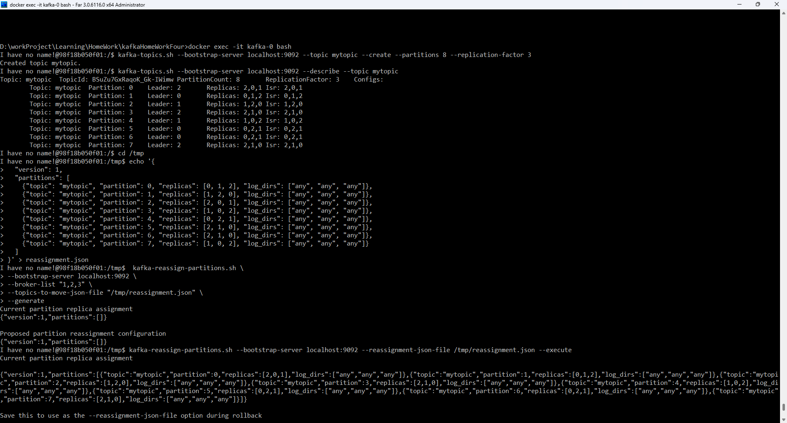
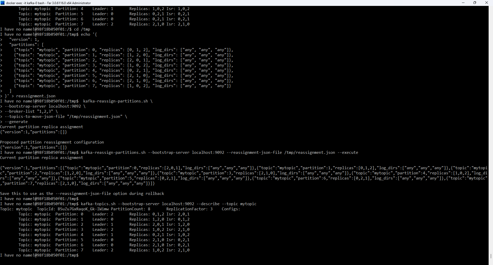
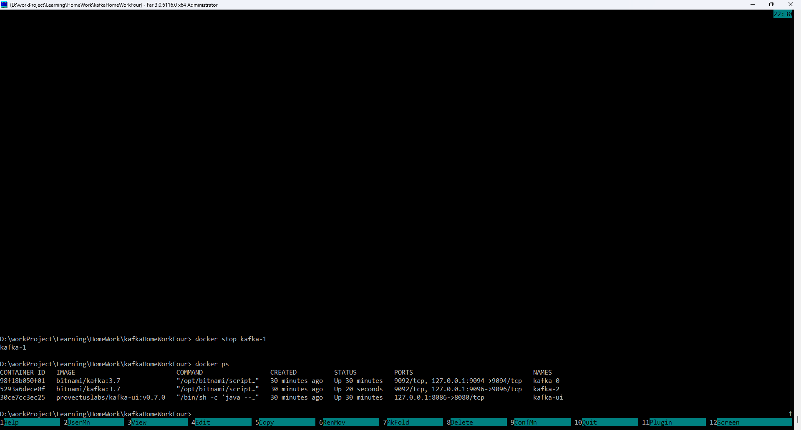
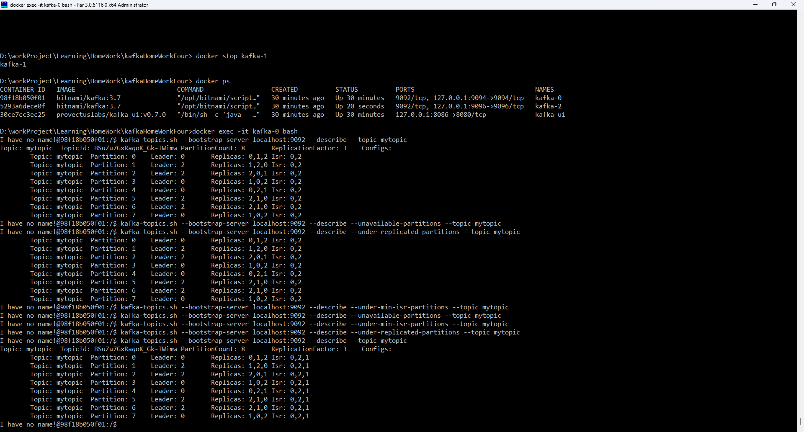

# Отчёт по перераспределению партиций и моделированию сбоя в Kafka

## 1. Создание топика `mytopic`
Создан новый топик `mytopic` с 8 партициями и фактором репликации 3.

### Команда:
```sh
kafka-topics.sh --bootstrap-server localhost:9092 --topic mytopic --create --partitions 8 --replication-factor 3 --if-not-exists
```

### Результат:


## 2. Определение текущего распределения партиций

### Команда:
```sh
kafka-topics.sh --bootstrap-server localhost:9092 --describe --topic mytopic
```


## 3. Создание файла `reassignment.json` и перераспределение партиций

Файл `reassignment.json` создан с новым распределением партиций.

### Содержимое `reassignment.json`:
```json
{
  "version": 1,
  "partitions": [
    {"topic": "balanced_topic", "partition": 0, "replicas": [1, 2, 3]},
    {"topic": "balanced_topic", "partition": 1, "replicas": [2, 3, 1]},
    {"topic": "balanced_topic", "partition": 2, "replicas": [3, 1, 2]},
    {"topic": "balanced_topic", "partition": 3, "replicas": [1, 3, 2]},
    {"topic": "balanced_topic", "partition": 4, "replicas": [2, 1, 3]},
    {"topic": "balanced_topic", "partition": 5, "replicas": [3, 2, 1]},
    {"topic": "balanced_topic", "partition": 6, "replicas": [1, 2, 3]},
    {"topic": "balanced_topic", "partition": 7, "replicas": [2, 3, 1]}
  ]
}
```
### Результат:


### Запуск создания плана переназначения разделов через инструмент kafka-reassign-partitions
```
 kafka-reassign-partitions.sh \
--bootstrap-server localhost:9092 \
--broker-list "1,2,3" \
--topics-to-move-json-file "/tmp/reassignment.json" \
--generate
```

### Запуск перераспределения:
```sh
kafka-reassign-partitions.sh --bootstrap-server localhost:9092 --reassignment-json-file /tmp/reassignment.json --execute
```

### Проверка статуса перераспределения:
```sh
kafka-topics.sh --bootstrap-server localhost:9092 --describe --topic mytopic
```

### Результат:


## 4. Моделирование сбоя брокера

### a. Остановка `kafka-1`
```sh
docker stop kafka-1
```
### Результат:


### b. Проверка состояния топиков после сбоя
#### подключаемся к контейнеру кафки
```sh
docker exec -it kafka-0 bash                                                                                                                                    
```
#### проверяем состояние топика
```sh
kafka-topics.sh --bootstrap-server localhost:9092 --describe --topic mytopic
kafka-topics.sh --bootstrap-server localhost:9092 --describe --unavailable-partitions --topic mytopic
kafka-topics.sh --bootstrap-server localhost:9092 --describe --under-min-isr-partitions --topic mytopic
kafka-topics.sh --bootstrap-server localhost:9092 --describe --under-replicated-partitions --topic mytopic
```


### c. Запуск `kafka-1`
```sh
docker start kafka-1
```

### d. Проверка восстановления синхронизации реплик
```sh
kafka-topics.sh --bootstrap-server localhost:9092 --describe --topic mytopic
kafka-topics.sh --bootstrap-server localhost:9092 --describe --unavailable-partitions --topic mytopic
kafka-topics.sh --bootstrap-server localhost:9092 --describe --under-min-isr-partitions --topic mytopic
kafka-topics.sh --bootstrap-server localhost:9092 --describe --under-replicated-partitions --topic mytopic
```

### Результат:


## 5. Выводы
- Топик `balanced_topic` был успешно создан с 8 партициями и фактором репликации 3.
- Перераспределение партиций выполнено успешно, о чём свидетельствует статус выполнения команды `--verify`.
- В процессе перераспределения партиций нагрузка на брокеры была перераспределена равномерно, обеспечивая баланс нагрузки.
- После моделирования сбоя `kafka-1` кластер продолжил работу, но партиции, назначенные брокеру `kafka-1`, временно потеряли реплики.
- После перезапуска `kafka-1` реплики восстановились, и кластер вернулся в стабильное состояние без потери данных.
- Данный процесс демонстрирует устойчивость Kafka к отказам и способность к самовосстановлению при сбоях.
- Полученные результаты подтверждают корректность настроек кластера, распределения партиций и механизма репликации.

---


