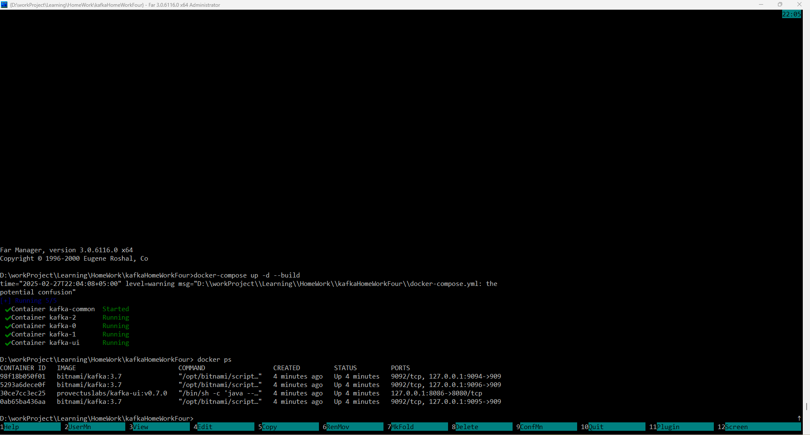
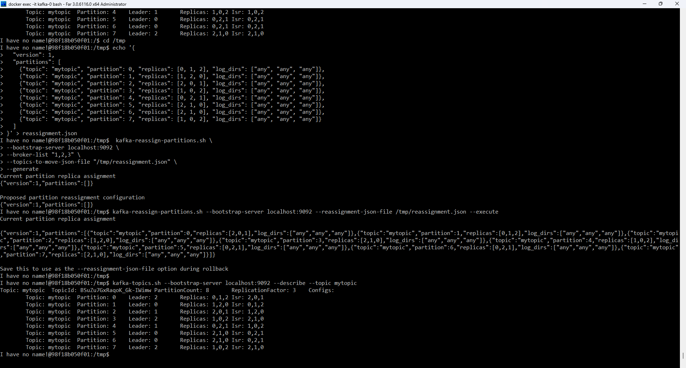
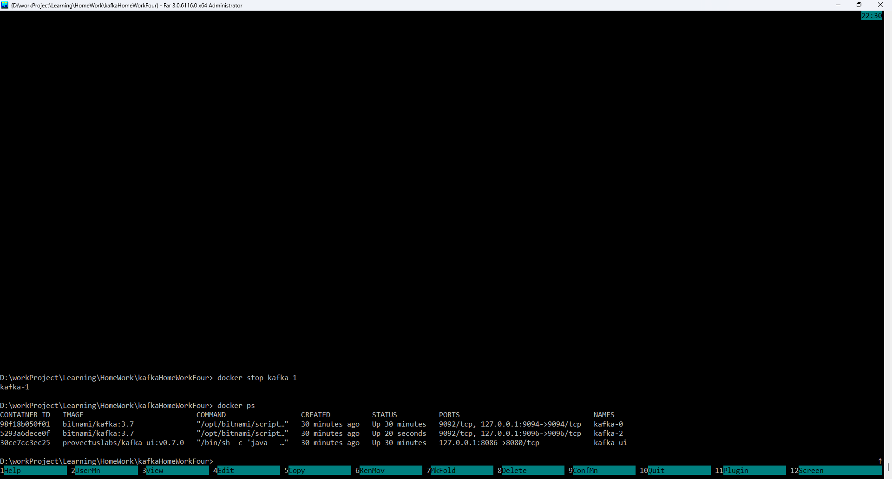
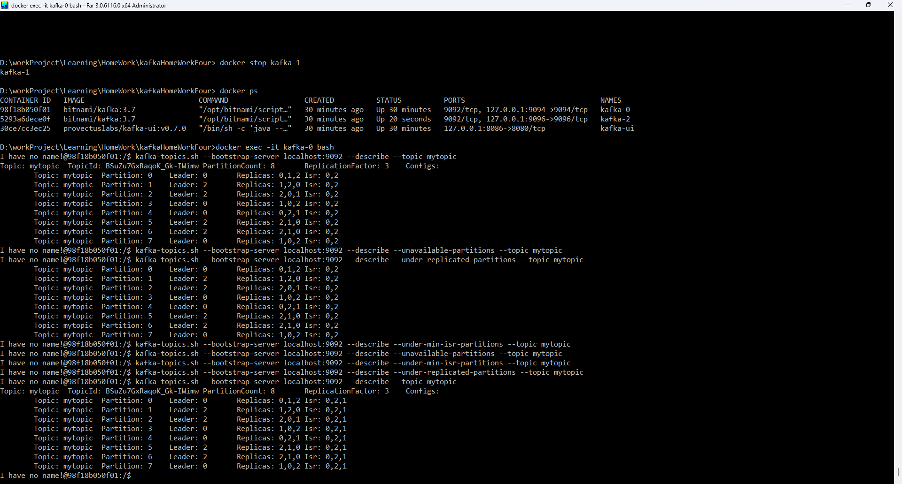

# Отчёт по балансировке партиций и диагностике кластера

## 1. Создание топика `mytopic`
Создан топик `mytopic` с 8 партициями и фактором репликации 3.

### Команда:
```sh
kafka-topics.sh --bootstrap-server localhost:9092 --topic mytopic --create --partitions 8 --replication-factor 3 --if-not-exists
```

### Результат:


## 2. Определение текущего распределения партиций
### Команда:
```sh
kafka-topics.sh --bootstrap-server localhost:9092 --describe --topic mytopic
```

## 3. Перераспределение партиций
Создан файл `reassignment.json` с новым распределением партиций.

### Содержимое:
```json
{
  "version": 1,
  "partitions": [
    {"topic": "mytopic", "partition": 0, "replicas": [0, 1, 2]},
    {"topic": "mytopic", "partition": 1, "replicas": [1, 2, 0]},
    {"topic": "mytopic", "partition": 2, "replicas": [2, 0, 1]},
    {"topic": "mytopic", "partition": 3, "replicas": [1, 0, 2]},
    {"topic": "mytopic", "partition": 4, "replicas": [0, 2, 1]},
    {"topic": "mytopic", "partition": 5, "replicas": [2, 1, 0]},
    {"topic": "mytopic", "partition": 6, "replicas": [2, 1, 0]},
    {"topic": "mytopic", "partition": 7, "replicas": [1, 0, 2]}
  ]
}
```

### Команды для перераспределения:
```sh
cd /tmp && echo '{
  "version": 1,
  "partitions": [
    {"topic": "mytopic", "partition": 0, "replicas": [0, 1, 2], "log_dirs": ["any", "any"]},
    {"topic": "mytopic", "partition": 1, "replicas": [1, 2, 0], "log_dirs": ["any", "any"]},
    {"topic": "mytopic", "partition": 2, "replicas": [2, 0, 1], "log_dirs": ["any", "any"]},
    {"topic": "mytopic", "partition": 3, "replicas": [1, 0, 2], "log_dirs": ["any", "any"]},
    {"topic": "mytopic", "partition": 4, "replicas": [0, 2, 1], "log_dirs": ["any", "any"]},
    {"topic": "mytopic", "partition": 5, "replicas": [2, 1, 0], "log_dirs": ["any", "any"]},
    {"topic": "mytopic", "partition": 6, "replicas": [2, 1, 0], "log_dirs": ["any", "any"]},
    {"topic": "mytopic", "partition": 7, "replicas": [1, 0, 2], "log_dirs": ["any", "any"]}
  ]
}' > reassignment.json
```
```sh
kafka-reassign-partitions.sh --bootstrap-server localhost:9092 --broker-list "1,2,3" --topics-to-move-json-file "/tmp/reassignment.json" --generate
```
```sh
kafka-reassign-partitions.sh --bootstrap-server localhost:9092 --reassignment-json-file /tmp/reassignment.json --execute
```
```sh
kafka-topics.sh --bootstrap-server localhost:9092 --describe --topic mytopic
```

### Результат:


## 4. Моделирование сбоя брокера
### a. Остановка `kafka-1`
```sh
docker stop kafka-1
```
### Результат:


### b. Проверка состояния топиков
```sh
docker exec -it kafka-0 bash
```
```sh
kafka-topics.sh --bootstrap-server localhost:9092 --describe --topic mytopic
kafka-topics.sh --bootstrap-server localhost:9092 --describe --unavailable-partitions --topic mytopic
kafka-topics.sh --bootstrap-server localhost:9092 --describe --under-min-isr-partitions --topic mytopic
kafka-topics.sh --bootstrap-server localhost:9092 --describe --under-replicated-partitions --topic mytopic
```

### c. Запуск `kafka-1`
```sh
docker start kafka-1
```

### d. Проверка восстановления
```sh
kafka-topics.sh --bootstrap-server localhost:9092 --describe --topic mytopic
```
### Результат:


## 5. Выводы
- Топик `mytopic` успешно создан с 8 партициями и фактором репликации 3.
- Перераспределение партиций выполнено успешно, баланс нагрузки между брокерами достигнут.
- После остановки `kafka-1` кластер продолжил работу, временно потеряв реплики.
- После перезапуска брокера реплики восстановились, кластер вернулся в стабильное состояние.
- Kafka продемонстрировала устойчивость к сбоям и способность к самовосстановлению.

